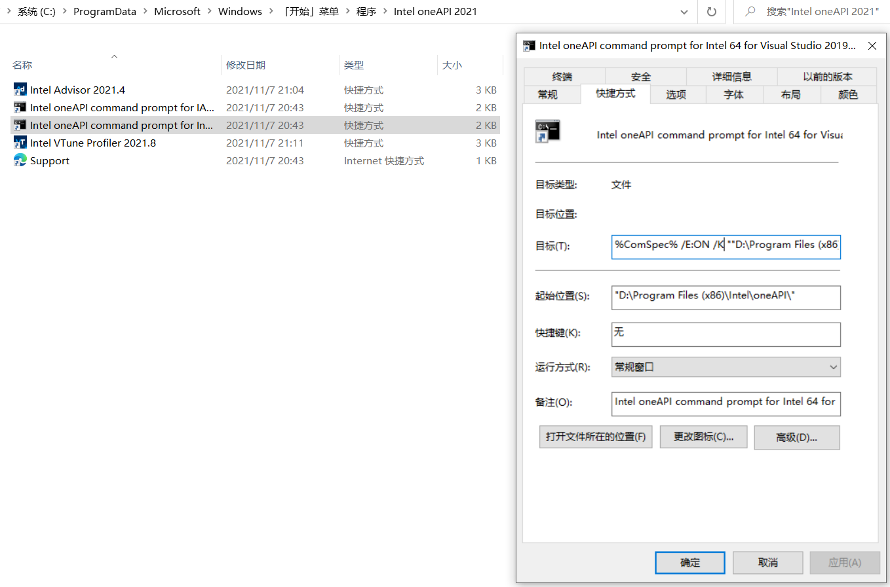

# 使用OneAPI套件

[Intel OneAPI](https://software.intel.com/content/www/us/en/develop/tools/oneapi/all-toolkits.html)为我们免费提供了两个版本的Fortran编译器，一个是经典的`ifort`，另一个是基于LLVM后端的`ifx`（尚处于beta版本），且拥有强大的MKL数学库，配套完善的开发测试组件，还有[丰富的帮助文档](https://software.intel.com/content/www/us/en/develop/documentation/get-started-with-fortran-compiler/top/get-started-on-windows.html)📔。

## 安装Visual Studio的注意事项

Windows下的Intel OneAPI往往是搭配最新版Visual Studio（简称，VS）使用，VS社区版是免费提供的。<br>
如果担心以后参加工作，VS企业版需要付费使用，你可以尝试在VS Code中使用[OneAPI](#在vs-code中使用oneapi套件)或者[GFortran](use-GFortran-in-Windows.md)🍻。

> 🔰 提示：实际上，VS搭配OneAPI是一对经典组合，稳定强劲。但我们仍推荐用户对Linux式（命令行式）编程有所浅尝，否则VS会极大地禁锢你的编程思维。

Windows下使用OneAPI，不一定必须要与VS搭配，Intel官方正在组织开发VS Code的OneAPI插件（尚不成熟），且[fortran-lang/fpm](https://github.com/fortran-lang/fpm)也支持OneAPI编译器，但对于新手和追求稳定性的用户还是推荐使用VS。

安装VS，要注意勾选以下4个组件⚙：


## 安装`Base Toolkit`和`HPC Toolkit`

对于新手用户，非常保守和默认的做法是安装`OneAPI Base Toolkit`和`OneAPI HPC Toolkit`，安装的时候稍微注意一下，是否在OneAPI安装过程中、与VS集成时出现惊叹号，这可能是因为你未完全安装以上图示4个VS组件：

1. 安装[最新版Visual Studio](https://visualstudio.microsoft.com/zh-hans/)；
2. 安装[`Base Toolkit`](https://software.intel.com/content/www/us/en/develop/tools/oneapi/all-toolkits.html#base-kit)（3.71GB）；
3. 安装[`HPC Toolkit`](https://software.intel.com/content/www/us/en/develop/tools/oneapi/all-toolkits.html#hpc-kit)（1.23GB）。

此后我们就**可以开始专心编程、实现业务了**。<br>

> 🔰 提示：<br>
> 1. 快捷键`CTRL F5`是开始运行（不调试），`F5`是开始调试。<br>
> 2. 进入菜单`工具>选项>文本编辑器>Fortran>Advanced`启用一些有用的Fortran IDE功能。<br>
> 3. 记得了解一点动态、静态链接库的概念。

## 安装OneAPI的独立组件（第二种方案）

通过安装`Base Toolkit`和`HPC Toolkit`，细心的话能发现，其中OneAPI套件包含了很多我们Fortran编程用不到的一些组件，占用了我们较多的电脑存储。<br>
且我们发现用户安装OneAPI的`Base Toolkit`和`HPC Toolkit`，会导致编程概念的模糊🧿：编码时，编译时，运行时，链接库等概念。<br>
所以我们引出**第二种安装OneAPI的方式，组件化、轻量化安装**，这往往适合极客、爱好者和家庭作业需求的学生。（如果你有很强的C-Fortran交互编程需求，推荐安全完整套件，此时安装独立组件的意义不大）

前往OneAPI的网页（[Single Component Downloads and Runtime Versions](https://software.intel.com/content/www/us/en/develop/articles/oneapi-standalone-components.html)）进行下载你所需要的组件，以OneAPI 2021.4发行版为例，我们推荐以下组件：

1. [OneAPI Fortran运行时](https://registrationcenter-download.intel.com/akdlm/irc_nas/18215/w_ifort_runtime_p_2021.4.0.3556.exe)（30.6MB）；
2. [OneAPI Fortran编译器](https://registrationcenter-download.intel.com/akdlm/irc_nas/18215/w_fortran-compiler_p_2021.4.0.3208_offline.exe)（603.65MB）；
3. [OneAPI MKL数学库](https://registrationcenter-download.intel.com/akdlm/irc_nas/18230/w_onemkl_p_2021.4.0.640_offline.exe)（1.22GB）（可选）。

> 🔰 提示：OneAPI中有Intel实现的Python解释器，它的性能比Python官方提供的编译器更强，如果有Python编程的需要，可以试一试。

## 在VS Code中使用OneAPI套件

Visual Studio中使用OneAPI很方便也简单，此处暂不介绍，现在介绍VS Code中使用OneAPI的可行方式，**我们依然想将OneAPI在Windows下编程从Visual Studio中
拉出来，加入fpm的生态进程中来。**

> 🔰 Intel 已经为 VS Code 开发了相关插件 [Environment Configurator for Intel(R) oneAPI Toolkits](https://marketplace.visualstudio.com/items?itemName=intel-corporation.oneapi-environment-configurator)，与下文原理类似，但其会一定程度拖慢 VS Code 的启动时间，相信之后能得到改善。

### 基本原理

OneAPI的运行环境依赖项较多，手动为它们添加环境路径几乎不现实，我们解析OneAPI在开始菜单为我们提供的命令行环境，来实现在VS Code的终端中引入OneAPI环境。



打开64位命令行工具快捷键的属性（作者的OneAPI安装在D盘，读者自行根据自身情况而定），解析其目标：

```sh
%ComSpec% /E:ON /K ""D:\Program Files (x86)\Intel\oneAPI\setvars.bat" intel64 vs2019"
```

此处的`%ComSpec%`指的是Windows系统的`CMD.exe`终端，实际上该快捷方式为了运行预设`*.bat`脚本，并传入命令行参数如`intel64 vs2019`来临时导入OneAPI
运行需要的环境变量，如`.dll`和`.lib`依赖和`.exe`引用。

### 自我实现

知道了这层原因，我们可以灵活地创建一个脚本，比如`set-ifort.bat`🚀来包含这个目标命令，将其置于我们的环境路径中，在需要`ifort`编译器时，在VS Code中的终端中
输入`set-ifort`启动`ifort`环境，这不算完美：1. 每次都需要手动启动`ifort`环境；2. `ifort`环境启动脚本是仅适应于`CMD`语法的。

> 🔰 提示：不必非常强迫症，在实际工作时，有解决方案是第一要义，也许以后有更好的使用方式。<br>
> 如果`ifort`环境是你的刚需，建议将`set-ifort`脚本运行写入`pwsh`或者`bash`的启动任务脚本中。

```sh
# set-ifort.bat
%ComSpec% /E:ON /K ""D:\Program Files (x86)\Intel\oneAPI\setvars.bat" intel64 vs2019"
```

### `ifort+fpm`的简单示例

我们使用`fpm`调用`ifort`运行这个示例代码，如果我们想从`ifort`的`CMD`环境换回熟悉的`bash`和`pwsh`，可以选择添加额外的终端，或者在终端中输入`bash`和`pwsh`。<br>
当我们需要`ifort`时，再输入`set-ifort`即可，同理，这种方式未来有有望在VS Code中使用基于`Conda`环境的`LFortran`。

```sh
fpm new --app hello_world && cd hello_world  # 创建fpm示例
code .      # 使用VS Code打开本地文件夹
set-ifort   # 启动ifort环境
fpm run --compiler ifort  # 让fpm使用ifort环境编译代码
```


> 🔰 提示：对`ifort`来说，遗憾的是`fpm`默认选择使用`gfortran`作为构建它本身和构建生态的编译器，未来的`LFortran`也能成为Fortran开源编译器的主将，没办法开源
> 社区使用开源编译器更便捷。除非未来`OneAPI`为用户提供完善的CI（持续集成）环境，并且在`fpm`逐渐成熟的时候，不犹豫地资助`fpm`，否则缺席Fortran开源的`OneAPI`会受到无意的
> “歧视”，因为未来Fortran的生态包，首先默认是开源编译器语法通过的。

## 其他链接

- [地球屋里老师：Fortran编译器及相关软件安装操作](https://www.bilibili.com/video/BV1oh411o7AT?p=2)
- [地球屋里老师：Windows系统下Fortran编程](https://www.bilibili.com/video/BV1XD4y1S7jz?spm_id_from=333.999.0.0)