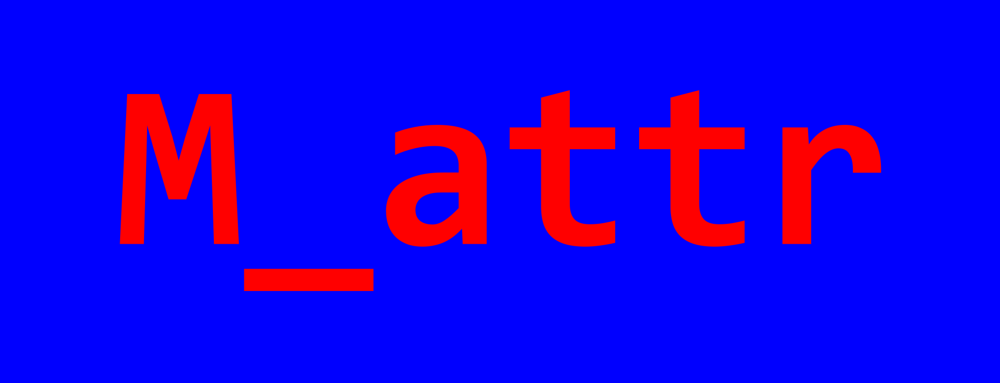

# 使用M_attr输出彩色控制台文本

M_attr仓库（许可证：MIT）：[https://github.com/urbanjost/M_attr](https://github.com/urbanjost/M_attr)

M_attr是urbanjost的开源项目，使用ANSI码escape序列来输出终端彩色文本属性。

<div align="center">

</div>

## 简介

M_attr之所以被推荐，是因为它足够简单，巧妙使用类似HTML的标记化风格来控制输出文本的属性。

它的应用场景主要是：
- 屏幕日志输出；
- 屏幕UI效果增强；
- 炫技。

另外，urbanjost是一个资深的Fortran开源开发者。

## 使用`M_attr`输出彩色控制台文本

使用`M_attr`的第一个问题是UTF8编码，一般Linux终端都是支持UTF8的，但是Windows自带的终端（CMD.exe和Powershell.exe）不支持。

可以通过以下方式来解决：
- 临时使用chcp命令来设置编码，如`chcp 65001`，这样就可以使用UTF8编码了。（推荐方式）
- 改变Windows系统的全局编码为UTF8。（不推荐！）

第一种方式，可以广泛地在Powershell或Fish等命令行终端的`$profile`文件中进行预设。

### `attr`函数

`M_attr`库的精髓即`attr`函数，我们建立一个简单的示例来演示它：

```sh
cd workspace  # 切换到你常用的工作区间
fpm new --app m_attr-demo  # 创建fpm项目
cd m_attr-demo && code .   # 切换到`m_attr-demo`文件夹，并使用vs code打开它
```

我们创建了一个`m_attr-demo`工程，使用vs code打开了它，我们可以在fpm工程的`fpm.toml`文件中添加以下语句，以使用`M_attr`：

```toml
[dependencies]
M_attr = { git="https://github.com/urbanjost/M_attr.git" }
```


我们可以使用属性的全称和缩写来标记目标文本，大写属性表示背景色，小写属性表示前景色。

### 示例代码

```fortran
program demo_M_attr
    use M_attr, only: attr
    print *, attr('<GREEN><bold><white> Hello World!</white></bold></GREEN><reset>')
    ! or
    print *, attr('<G><bo><w> Hello World!')
end program demo_M_attr
```

## 说明

`attr`函数是核心函数，除此之外，还有一些辅助函数，可以对内部实现效果进行自定义调整，建议深度使用者细读源代码和帮助文档。