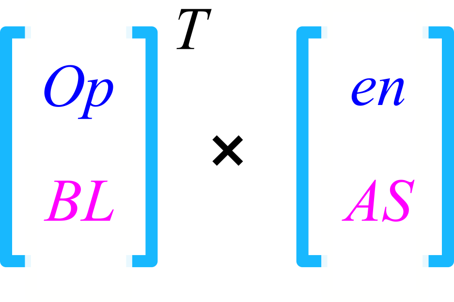

# 使用OpenBLAS进行矩阵计算

OpenBLAS官网：[https://www.openblas.net/](https://www.openblas.net/)<br>
BLAS网站：[http://www.netlib.org/blas/#_blas_routines](http://www.netlib.org/blas/#_blas_routines)🎯

BLAS（Basic Linear Algebra Subprograms）是著名的基础线性代数库，我们推荐使用被深度优化的OpenBLAS来进行线性代数计算。

BLAS库中的函数操作根据运算对象分为三类，它们的时间复杂度依次递增：

- Level 1：向量间的运算（1979年~）；
- Level 2：矩阵与向量的运算（1988年~）；
- Level 3：矩阵间的运算（1990年~）。

<div align="center">

</div>

## 安装OpenBLAS

我们使用MSYS2软件能非常便捷地安装OpenBLAS（假设你已经安装了MSYS2，并且配置了系统环境变量）：

```sh
pacman -Ss openblas  # 查询名字中含“openblas”字符的包
pacman -S  ucrt64/mingw-w64-ucrt-x86_64-openblas  # 安装openblas
```

## Blas/Lapack的接口说明

- 函数或子程序命名格式为`ABBCCC` ，其中A表示数据类型，BB表示矩阵类型，CCC表示运算类型(不足三个一般写CC)。
- A 有四种(S/D/C/Z)，S 表示单精度浮点数`real(4)`，D表示双精度浮点数`real(8)`，C表示单精度复数`complex(4)`,Z表示双精度复数`complex(8)`。
- BB 例如 ge/一般矩阵，sy/对称矩阵，he/厄密矩阵等等，全部的类型可以在该网站查找， [矩阵类型](https://www.netlib.org/lapack/lug/node24.html)。
- CCC 例如 svd/svd分解，mm/矩阵相乘，ev/特征值问题等等。
- 组合起来，例如 dgemm/(双精度一般矩阵的乘法)，dsyev/(双精度对称矩阵的特征值问题)。关于全部接口的描述，参考网站， [Blas/Lapack接口](http://www.netlib.org/lapack/explore-html/modules.html)。
- 调用时,查看对应的接口，了解函数或者子程序的返回值，填写与之对应的参数，了解报错时返回值的含义。
- 目前并不支持四精度，如果需要，可自行下载源代码替换类型。


## 演示：OpenBLAS求解线性方程组

```sh
cd workspace  # 切换到你常用的工作区间
fpm new --app solve-demo  # 创建fpm项目
cd solve-demo && code .   # 切换到`solve-demo`文件夹，并使用vs code打开它
```

不出意外的话，我们创建了一个`solve-demo`工程，并且使用vs code打开了它，我们在`fpm.toml`中添加声明来引用安装的OpenBLAS链接库：

```toml
[build]
link = ["openblas"]
```


通过使用双精度的线性方程组求解例程`dgesv`，我们求解到了预设方程组`Ax = b`的正确结果🚀：`x = [1.0; 3.0]`。

> 🔰 提示：这只是一个简单的演示，更多的例程使用还需要用户自行前往官方网站查询帮助文档。<br>
> 做工程不是搞艺术，而且用户是被提供服务一方，不要过于纠结API接口的美观与否，形成可行的解决方案始终是第一要义。

### 示例代码

```fortran
program main

    use, intrinsic :: iso_fortran_env, only: real64
    implicit none
    real(real64) :: A(2, 2), b(2, 1)  !! 线性方程组矩阵
    integer :: ipiv(2)  !! openblas中的行列交换标记、工作数组
    integer :: info     !! openblas中的返回值

    A = reshape([1.0, 3.0, 2.0, 4.0], [2, 2])
    b = reshape([7.0, 15.0], [2, 1])

    !> `dgesv`求解双精度线性方程组
    call dgesv(2, 1, A, 2, ipiv, b, 2, info)

    !> 最简单的测试
    call check(info == 0, "`info == 0` failed")
    call check(abs(b(1, 1) - 1.0) < 1.0E-6, "`b(1,1) == 1.0` failed")
    call check(abs(b(2, 1) - 3.0) < 1.0E-6, "`b(2,1) == 3.0` failed")

    print *, "结果符合预期，正常退出 ^_^"
contains

    !> 断言与测试
    subroutine check(condition, msg)
        logical, intent(in) :: condition     !! 测试条件
        character(len=*), intent(in) :: msg  !! 测试失败时的消息
        if (condition) return
        error stop msg
    end subroutine check

end program main
```
