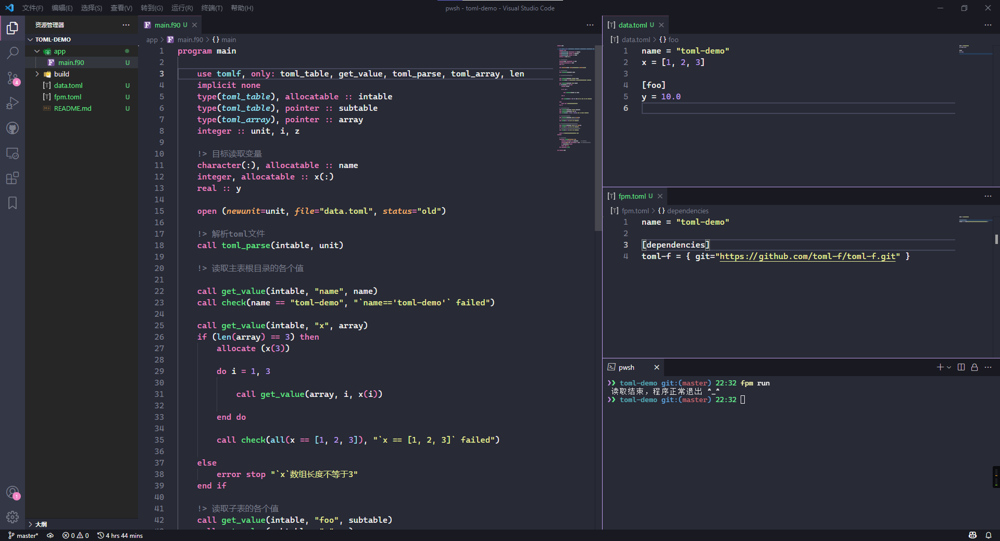

# 为程序设置配置文件：TOML

TOML官网🎯：[https://toml.io/cn/](https://toml.io/cn/)<br>
TOML-F仓库（许可证：Apache License v2或者MIT License）：[https://github.com/toml-f/toml-f](https://github.com/toml-f/toml-f)

TOML（Tom的（语义）明显、（配置）最小化的语言）主要被设计为程序的配置文件，简单易用，典型地被fpm、cargo、julia作为代码包的配置文件。<br>
TOML也可被用作有限制性的、数据序列化的数据存储文件。

`toml-f`是Fortran语言的TOML解析实现，我们可以使用它作为Fortran程序的配置文件。

<div align="center">

</div>

## `toml-f`读取toml的API

在演示`toml-f`示例之前，我们来熟悉一（亿）下`toml-f`的API😎。

### `toml_parse`：解析`toml`

从字符串（`character(:), allocatable`）或者文件单元号（`unit`）读取toml信息，这是解析toml内容的第一步。

```fortran
call toml_parse(table, in [, error])
```

|变量|类型|意义|
|--|--|--|
|`table`|`toml_table`类型，`allocatable`和`intent(out)`|toml表格实例|
|`in`|`integer`或者`character(:), allocatable`类型，`intent(in)`|控制从文件单元号，或字符串中读取toml信息|
|`error`|`toml_error`类型，`intent(out)`和`optional`|错误提示|

### `get_value`：读取变量的值

从toml表格中读取确定键（key）的值（value）。

```fortran
call get_value(table [, pos], ptr [, requested/default, stat])
```

|变量|类型|意义|
|--|--|--|
|`table`|`toml_table/toml_array/toml_keyval`类型，`intent(inout)`|toml表格实例/数组指针/键值指针|
|`pos`|`toml_array/toml_key/integer`类型，`intent(in)`|toml表格中的位置|
|`ptr`|`integer`或者`character(:), allocatable`类型，`intent(in)`|变量的值，或者子表格的指针|
|`requested`|`logical`类型，`intent(in)`和`optional`|是否请求在toml表格中添加默认值|
|`default`|`real/integer/logical/character(*)`类型，`intent(in)`|读取toml信息时，信息不存在，预设的默认值|
|`stat`|`integer`类型，`intent(out)`和`optional`|返回`0`为成功|

### `destory`：析构`toml`缓存（可忽略）

在读取完toml信息，我们**可选地**析构`toml_table`内的内容。

```fortran
call table%destory()
```

|变量|类型|意义|
|--|--|--|
|`table`|`toml_table`类型|toml表格实例|

> 🔰 除非你在某个`module`内声明了一个`module`内的全局`toml_table`，要节约内存，否则，**这个析构例程请大胆地忽略它**。
> 因为在单元例程中的`toml_table`类型变量在例程结束后，就会结束其生命周期。

## 演示`toml-f`库的读取功能

```sh
cd workspace  # 切换到你常用的工作区间
fpm new --app toml-demo  # 创建fpm项目
cd toml-demo && code .   # 切换到`toml-demo`文件夹，并使用vs code打开它
```
我们创建了一个`toml-demo`工程，使用vs code打开了它，我们可以在fpm工程的`fpm.toml`文件中添加以下语句，以使用`toml-f`：

```toml
[dependencies]
toml-f = { git="https://github.com/toml-f/toml-f.git" }
```

在`toml-f`仓库的[README.md中](https://github.com/toml-f/toml-f#usage)🕹提供了一个简单的示例。我们自己写个示例进行演示：



我们读取了所有toml内的数据，读取结果全部符合预期，程序正常退出了🚀。

### 示例代码

```fortran
program main

    use tomlf, only: toml_table, get_value, toml_parse, toml_array, len
    implicit none
    type(toml_table), allocatable :: intable
    type(toml_table), pointer :: subtable
    type(toml_array), pointer :: array
    integer :: unit, i, z

    !> 目标读取变量
    character(:), allocatable :: name
    integer, allocatable :: x(:)
    real :: y

    open (newunit=unit, file="data.toml", status="old")

    !> 解析toml文件
    call toml_parse(intable, unit)

    !> 读取主表根目录的各个值
    
    call get_value(intable, "name", name)
    call check(name == "toml-demo", "`name=='toml-demo'` failed")

    call get_value(intable, "x", array)
    if (len(array) == 3) then
        allocate (x(3))

        do i = 1, 3

            call get_value(array, i, x(i))

        end do

        call check(all(x == [1, 2, 3]), "`x == [1, 2, 3]` failed")

    else
        error stop "`x`数组长度不等于3"
    end if

    !> 读取子表的各个值
    call get_value(intable, "foo", subtable)
    call get_value(subtable, "y", y)
    call check(abs(y - 10.0) < 1.0E-6, "`y == 10.0` failed")

    !> 读取一个不存在的值
    call get_value(intable, "z", z, stat=i)
    !> *注意*：z值不存在，但i返回成功值`0`
    call check(i == 0, "`i == 0` failed")

    !> 读取一个不存在的值，但提供默认值
    call get_value(intable, "z", z, 1, stat=i)
    call check(i == 0, "`i == 0` failed")
    !> 值不存在，但提供默认值，则z返回默认值
    call check(z == 1, "`z == 1` failed")

    print *, "读取结束，程序正常退出 ^_^"
contains

    !> 断言与测试
    subroutine check(condition, msg)
        logical, intent(in) :: condition     !! 测试条件
        character(len=*), intent(in) :: msg  !! 测试失败时的消息
        if (condition) return
        error stop msg
    end subroutine check

end program main
```

```toml
# data.toml
name = "toml-demo"
x = [1, 2, 3]

[foo]
y = 10.0
```

## 说明

```fortran
module tomlf
    public :: get_value, set_value  !! 读取、写入值
    public :: toml_parse            !! 解析toml
    public :: toml_error, toml_stat !! toml-f辅助类型
    public :: toml_serializer       !! toml-f序列化例程
    public :: toml_table, toml_array, toml_key, is_array_of_tables, new_table, add_table, add_array, len
                                    !! toml-f辅助例程
    public :: sort                  !! toml-f排序
    public :: tomlf_version_string, tomlf_version_compact, get_tomlf_version  !! toml-f版本管理例程
end module tomlf
```

`toml-f`的API可以在[`https://toml-f.github.io/toml-f/`](https://toml-f.github.io/toml-f/)找到，也可以直接阅读源码，非常推荐阅读它的[单元测试源码](https://github.com/toml-f/toml-f/tree/main/test/tftest)，里面有着很全的API使用。

你可以模仿`fpm.toml`中toml的写法，或者去[TOML官网](https://toml.io/cn/)查阅toml语法。

我们先学习如何使用`toml-f`解析读取toml信息，在此过程中，我们逐渐熟悉其API的使用，读者如果有**输出toml**的需求，很容易理解使用`toml-f`写入toml。

需要注意的有两点：

- `toml`与`json`的转换在[`toml-f`的单元测试](https://github.com/toml-f/toml-f/tree/main/test)中提供了代码。<br>
  `json-fortran`（许可证：类似BSD）：[https://github.com/jacobwilliams/json-fortran](https://github.com/jacobwilliams/json-fortran)
- 从toml文件中尝试解析不存在的键值对，`toml-f`不认为是错误，所以请读取变量的设置默认值。
- 在手动设置`.toml`内容时，注意整型和浮点型的区别，`x = 1`中`x`始终被认为是整型，`x = 1.0`中`x`才是浮点型，这点往往会被忽视。
