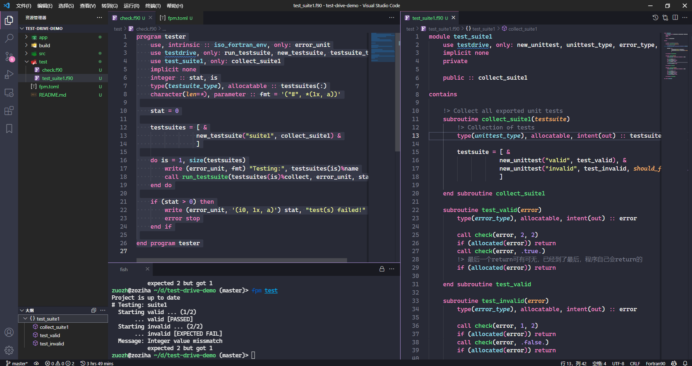

# 使用`test-drive`测试你的代码

`test-drive`库（许可证：MIT或Apache 2.0）：[https://github.com/fortran-lang/test-drive](https://github.com/fortran-lang/test-drive)

在代码开发中，合理的单元测试可以解放自己的双手，让计算机使用事先写好的测试代码自动化验证你的业务代码。

`test-drive`原为Sebastian Ehlert开发的单元测试库，质量很高，现在已经移交到Fortran-lang组织命名空间下。

<!-- @todo: LOGO -->

## 简介

test-drive现在由Fortran-lang组织维护开发，它的使用相对简单，巧妙使用回调函数，设计较为合理，且适应于配合fpm使用。

它的应用场景主要是：
- 函数库的开发（简单）；
- 可执行程序的开发（复杂些）。

另外，[Sebastian Ehlert](https://github.com/awvwgk)也是一名资深的Fortran开源开发者。

## `test-drive`演示

我们使用`test-drive`库中`README.md`的示例，进行演示：

```sh
cd workspace  # 切换到你常用的工作区间
fpm new --app test-drive-demo  # 创建fpm项目
cd test-drive-demo && code .   # 切换到`test-drive-demo`文件夹，并使用vs code打开它
```

我们创建了一个`test-drive-demo`工程，使用vs code打开了它，我们可以在fpm工程的`fpm.toml`文件中添加以下语句，以使用`test-drive`：
```toml
[dependencies]
test-drive = { git="https://github.com/fortran-lang/test-drive.git" }
```



通过在分类的module里设置相关单元测试，建立一个或多个主测试程序，使用`fpm test`命令，对业务代码进行单元测试。

单元测试的实现**核心是判断**，在这里体现为`check`子例程，当`condition`为不符合预期的`.false.`时，程序中断，提示用户，计算结果不符合预期。

这在我们开发和修改业务代码内容时，提供了一个检查预期待的途径，帮助我们节省人力物力。这在代码开发中，也叫做TDD（test-drived developement，测试驱动开发）。

## 示例代码

**主测试程序**
```fortran
program tester
    use, intrinsic :: iso_fortran_env, only: error_unit
    use testdrive, only: run_testsuite, new_testsuite, testsuite_type
    use test_suite1, only: collect_suite1
    implicit none
    integer :: stat, is
    type(testsuite_type), allocatable :: testsuites(:)
    character(len=*), parameter :: fmt = '("#", *(1x, a))'

    stat = 0

    testsuites = [ &
                 new_testsuite("suite1", collect_suite1) &
                 ]

    do is = 1, size(testsuites)
        write (error_unit, fmt) "Testing:", testsuites(is)%name
        call run_testsuite(testsuites(is)%collect, error_unit, stat)
    end do

    if (stat > 0) then
        write (error_unit, '(i0, 1x, a)') stat, "test(s) failed!"
        error stop
    end if

end program tester
```

**单元测试模块**
```fortran
module test_suite1
    use testdrive, only: new_unittest, unittest_type, error_type, check
    implicit none
    private

    public :: collect_suite1

contains

    !> Collect all exported unit tests
    subroutine collect_suite1(testsuite)
        !> Collection of tests
        type(unittest_type), allocatable, intent(out) :: testsuite(:)

        testsuite = [ &
                    new_unittest("valid", test_valid), &
                    new_unittest("invalid", test_invalid, should_fail=.true.) &
                    ]

    end subroutine collect_suite1

    subroutine test_valid(error)
        type(error_type), allocatable, intent(out) :: error
        
        call check(error, 2, 2)
        if (allocated(error)) return
        call check(error, .true.)
        !> 最后一个return可有可无，已经到了最后，程序自己会return的
        if (allocated(error)) return
        
    end subroutine test_valid

    subroutine test_invalid(error)
        type(error_type), allocatable, intent(out) :: error
        
        call check(error, 1, 2)
        if (allocated(error)) return
        call check(error, .false.)
        if (allocated(error)) return
        
    end subroutine test_invalid

end module test_suite1
```

## 说明

`test-drive`设计合理，源码很值得学习。
除了该库以外，还有很多其他优秀的Fortran单元测试库，此处暂不做介绍。