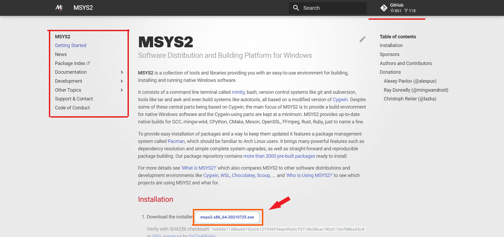
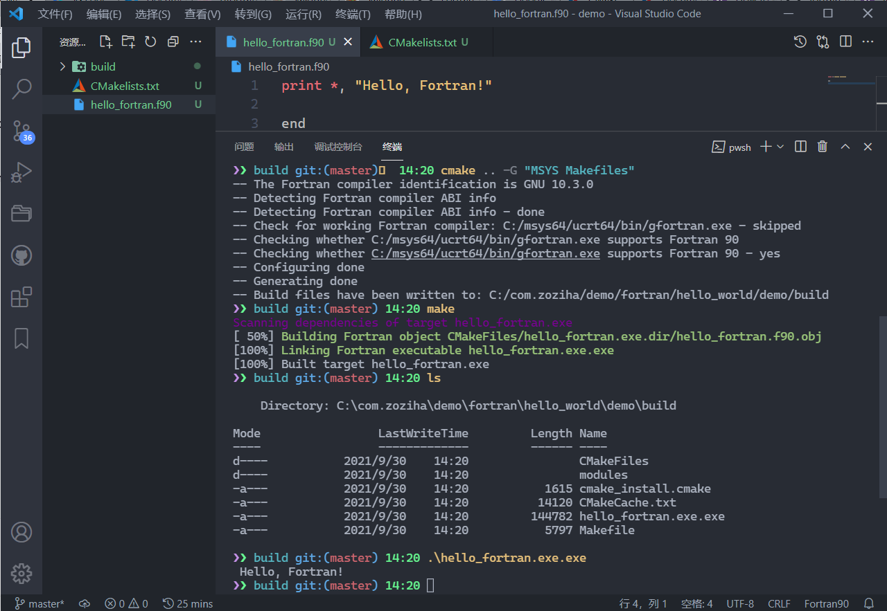
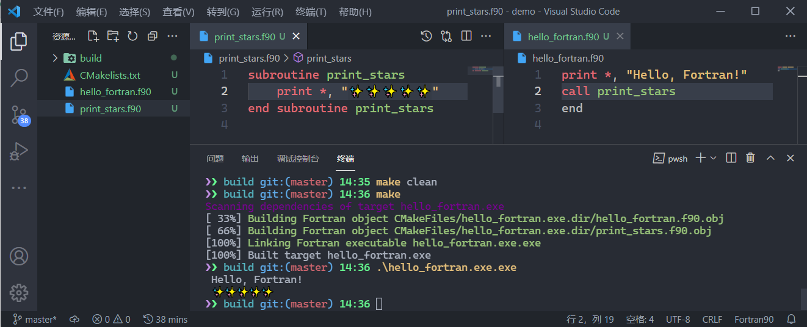

# 使用GFortran

微软公司开发的Windows系统具有强大的图形用户界面🎨，是我们常用的操作系统。<br>
GCC Fortran编译器，对Fortran新标准的支持非常及时，是一款免费🍻的开源软件。

> 🔰 提示：以下教程，同样适用于在**Visual Studio Code**中使用Intel OneAPI（需要做出适应性改变：gfortran改为ifort）。安装OneAPI请参考[安装OneAPI的独立组件（第二种方案）](use-OneAPI-in-Windows.md#安装oneapi的独立组件第二种方案)。

## 使用MSYS2-GFortran

可以将MSYS2简单地理解为一个包管理器，集成了`pacman`和[`Mingw-w64`](https://sourceforge.net/projects/mingw/)。

### 安装MSYS2软件

前往[MSYS2项目官方网站](https://www.msys2.org/)📡，点击图示箭头指向的链接，下载MSYS2软件，阅读网页提供的[安装教程进行安装和使用](https://www.msys2.org/wiki/Home/)📜。



当我们在使用MSYS2软件的过程中遇到困难或者软件漏洞时，我们可以向[MSYS2项目的GitHub仓库的议题](https://github.com/msys2/msys2.github.io/issues)🎯寻求帮助。

### 安装MSYS2-GFortran软件

首先，我们熟悉一下MSYS2软件的命令行基础操作🕹，这在MSYS2项目官方提供的文档中能找到：

```sh
pacman -Syu                  # 升级msys2内部组件和仓库信息
pacman -Ss <package_name>    # 搜索软件
pacman -S  <package_name>    # 安装软件
pacman -Qs <package_name>    # 查询本地安装的特定软件
pacman -Rs <package_name>    # 卸载软件
pacman -R --help             # 查询命令的帮助文档
...
```

请务必灵活🏓使用MSYS2软件，该软件在运行前有一些个性化的配置文件可以设置，当然保持默认也是不错的。<br>现在我们知道，可以通过下面的方式在MSYS2软件中安装GFortran：

```sh
pacman -Ss fortran           # 查询名字中含“Fortran”字符的包
pacman -S  ucrt64/mingw-w64-ucrt-x86_64-gcc-fortran    # 安装ucrt64版本的gfortran
```

当然，我们还可以使用MSYS2软件，下载`GNU Make/CMake/openBLAS/Python/Golang/...`等丰富的软件或者链接库。GCC WIKI为我们提供了[一些GFortran的信息文档](https://gcc.gnu.org/wiki/GFortran)，其中就有[GFortran最新的帮助文档](https://gcc.gnu.org/onlinedocs/gfortran.pdf)。

```sh
gfortran <name>.f90          # 编译fortran源代码文件
gfortran --help              # 查询gfortran命令行参数的帮助文档
...
```

如果我们没有更改MSYS2软件的安装路径，则安装的GFortran软件应该是在`C:\msys64`路径下的特定环境的子文件下，我们最好将它引入到Windows软件的的环境路径🔗中，以方便我们使用它（gfortran.exe）。例如路径，

```sh
C:/msys64/ucrt64/bin         # 二进制的可执行程序所在路径
C:/msys64/ucrt64/lib         # 可执行程序的动态链接库依赖所在路径
```

> 🔰 提示：这里默认我们现在大多数使用的硬件是64位的，且使用较新的MSYS2环境（UCRT），有个性化需求可以进行自定义。

## 使用Visul Studio Code编辑器进行编码

[Visual Studio Code（简称，VS Code或code）](https://code.visualstudio.com/)是一款由微软公司主导的免费开源、逐渐强大的代码编辑器软件。<br>
初次使用VS Code编辑器，可以尝试阅读[VS Code帮助文档](https://code.visualstudio.com/docs)。

### 推荐的VS Code插件

针对Fortran编程，我们有一些可以方便特定编程需求的插件🛠，被列出来仅供参考：

```markdown
+ 中文软件包插件
+ Modern Fortran
+ Fortran IntelliSense
+ GDB Debugger - Beyond
+ Copilot (可选)
+ VSCode Great Icons (可选)
+ Better TOML (可选)
```

### 推荐的编程样式

为了提高代码的可读性💡，可以使用以下的单元编程样式：

```fortran
!> 相加
subroutine add(x, y, z)
    
    real, intent(in)  :: x, y
    real, intent(out) :: z     !! 返回值
    
    !> 加法
    z = x + y
    
end subroutine add
```

在区块代码前使用`!>`注释标头使得VS Code的Fortran插件能解析注释；在单行注释时，有品位地使用`!>`或`!!`可以提高代码的可读性。

> `!>`注释标头被[Fortran-Lang组织](https://github.com/fortran-lang)与[社区](https://fortran-lang.discourse.group/)广泛使用。

### 使用FPM构建Fortran代码

[Fortran Package Manager（FPM）](https://github.com/fortran-lang/fpm)是Fortran-Lang组织主导、为Fortran语言专门定制开发的免费、开源的包管理器和构建系统。

> 🔰 提示：fortran-lang/fpm不仅支持GFortran，还支持OneAPI和[LFortran](https://lfortran.org/)等其他Fortran编译器。

我们现在可以使用MSYS2软件来安装FPM，也可以前往[Fortran Package Manager (fpm) (github.com)](https://github.com/fortran-lang/fpm)仓库手动编译出可执行程序FPM，届时务必阅读仓库提供的帮助文档[`README.md`](https://github.com/fortran-lang/fpm#readme)。别忘了将手动编译的FPM引入Windows软件的的环境路径🔗中，以方便我们使用它（fpm.exe）。

```sh
pacman -Ss fpm              # 查询名字中含“fpm”字符的包
pacman -S ucrt64/mingw-w64-ucrt-x86_64-fpm  # 安装fpm软件
```

**我们来演示一个FPM项目的初始化、编写、构建、运行：**

我们可以搭配命令行工具（pwsh、bash）使用FPM，也可以在VS Code打开hello_world文件夹，**此后我们就可以专心编写代码了**💻。

```sh
fpm new hello_world && cd hello_world       # 新建FPM项目并切换到文件夹下: hello_world
fpm build                   # 编译FPM项目
fpm run                     # 运行主程序🚀
fpm test --help             # 获取特定命令行参数的帮助文档
code .                      # 使用VS Code打开当前文件夹
...
```


> 🔰 提示：`fpm build`类似Visual Studio的Debug模式，`fpm build --profile release`类似Visual Studio的Release模式。

作为用户，我们可以阅读🔍[fpm的用户中文帮助文档](https://fpm.fortran-lang.org/zh_CN/index.html)；如果我们想成为FPM的贡献者和开发者，阅读[FPM开发者文档](https://fpm.fortran-lang.org/index.html#fortran-package-manager-developer-documentation)将是有帮助的。

### 使用CMake构建代码（可选）

CMake是一款免费、开源、优秀的代码构建系统，它的跨平台能力很强、支持多编译器，功能强大同时也具有一定难度。<br>
我们可以前往[CMake官方网站](https://cmake.org/)阅读[帮助文档](https://cmake.org/documentation/)。

```sh
pacman -Ss cmake            # 查询名字中含“cmake”字符的包
pacman -S  ucrt64/mingw-w64-ucrt-x86_64-cmake   # 安装CMake软件
cmake  --help               # 获取cmake命令行参数的帮助文档
```

#### 单个源文件代码

CMake使用配置文件来构建我们的代码，如`CMakelists.txt`。假设我们想构建一个“Hello Fortran”代码，在`hello_fortran.f90`同一文件夹下，我们创建一个`CMakelists.txt`：

```cmake
cmake_minimum_required(VERSION 3.0)                     # 设置要使用CMake的最小版本，此处取为3.0

project(fortran_basics LANGUAGES Fortran)               # 设置工程的名字为fortran_basics，和编译工程的编程语言为Fortran

set(CMAKE_Fortran_MODULE_DIRECTORY
    ${CMAKE_BINARY_DIR}/modules)
file(MAKE_DIRECTORY ${CMAKE_Fortran_MODULE_DIRECTORY})  # 设置编译器编译代码生成的*.mod文件被储存在目标构建文件夹下

add_compile_options(-Wall -Wextra)                      # 设置额外的编译器选项（命令行参数），此处为`-Wall -Wextra`

add_executable(hello_fortran.exe hello_fortran.f90)     # 设置具体的编译内容，此处设置将hello_fortran.f90编译成hello_fortran.exe
```

当我们编译代码时，CMake会生成很多具体的配置文件，可以将它们生成在一个叫做`build`的文件夹下，以保持整齐的文件夹内容。

```sh
mkdir build && cd build     # 新建一个文件夹`build`，并切换到该文件夹
cmake -G "MSYS Makefiles" ..    # CMake根据命令行参数`-G "MSYS Makefiles" ..`和CMakelists.txt的信息生成makefiles
make                        # 现在我们可以使用make来编译代码了
./hello_fortran.exe         # 编译成功，我们可以运行代码了
```



#### 多个源代码文件

```cmake
add_executable(hello_fortran.exe 
    hello_fortran.f90
    print_stars.f90)  # 我们需要更新CMakelists.txt中具体的编译内容，增加print_stars.f90编译到hello_fortran.exe
```



## 使用VS Code进行代码调试

调试的方法主要有两种，一种是`write`到屏幕或文件中，另一种是使用GDB类的软件来调试。

### 使用GDB来调试代码

GDB是GNU开源的Debug免费软件，可以前往[GDB官网](https://www.gnu.org/software/gdb/)
下载[帮助文档](https://sourceware.org/gdb/download/onlinedocs/gdb.pdf)。

```sh
pacman -Ss gdb              # 查询名字中含“gdb”字符的包
pacman -S  ucrt64/mingw-w64-ucrt-x86_64-gdb     # 安装gdb软件
gdb  --help                 # 获取gdb命令行参数的帮助文档
```

使用GDB软件的命令行模式更强大，但也对使用者的要求也更高。<br>
在VS Code中我们可以通过安装`GDB Debugger - Beyond`插件扩展来运行**图形化的GDB调试流程**。


你需要做的是先完整地阅读[它的概述📌](https://marketplace.visualstudio.com/items?itemName=coolchyni.beyond-debug)（上面动图来自该概述链接），
然后在`GDB Debugger - Beyond`插件生成的`.vscode/launch.json`文件中设置好输出`-g`后的可执行程序`*.exe`，设置好断点，启动调试模式！

```json
{
    "version": "0.2.0",
    "configurations": [
        {
            "type": "by-gdb",
            "request": "launch",
            "name": "Launch(gdb)",
            "program": "./a.exe",  // 设置好输出`-g`的含调试信息的可执行程序，最好使用相对路径，简单易用。
            "cwd": "${workspaceRoot}"
        }
    ]
}
```

为了方便我们查找代码BUG，GFortran提供了一些非常有用的编译选项，可以进行编译时和运行时的示警和报错。<br>

```sh
# -fcheck=bounds: 数组越界检查
# -std=f2008: 强制使用Fortran2008的语法规范，保证程序跨编译器，跨平台
# -Wall: 检查一些常见的Warning，例如变量未使用，变量未初始化等等
# ... ...
gfortran -g -fcheck=bounds -std=f2008 -Wall hello_world.f90
```

我们推荐使用FPM软件来构建代码，FPM默认会启用一些编译选项。例如，
```
-Wall -Wextra -Wimplicit-interface -fPIC -fmax-errors=1 -g -fcheck=bounds -fcoarray=single
```