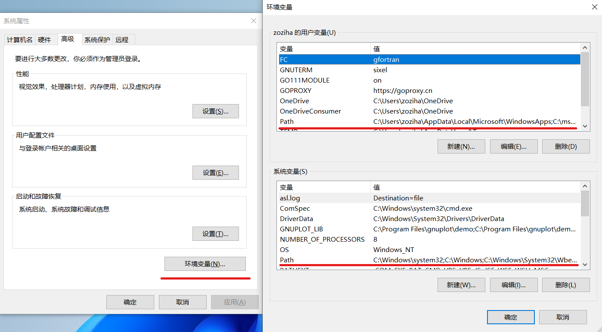

# 环境路径

在Windows下进行编程，往往离不开环境路径，它使得可执行程序可以被索引。 
通过在键盘上按下`Win`键，再输入`path`可以快速启动“编辑系统环境变量”。

## 用户变量和系统变量

一台计算机可以创建多个用户账户。 
用户变量框内设置的环境变量只适用于计算机的当前账号；系统变量框内设置的环境变量将适用于该计算机的所有用户账号。

## 三类环境变量

需要注意的是环境变量根据用途，主要可以分为三类：
1. `Path`：存储可执行程序的路径；
2. `OS`：值一般为`Windows_NT`，用以程序判断当前系统类型；
3. 其他环境变量。